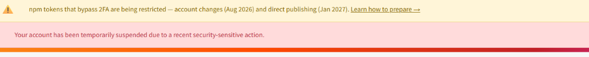
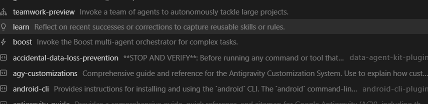

# LexicalLayer

<div align="center">

[](LICENSE)
[](https://www.npmjs.com/package/@lexicallayer/sdk)
[](https://www.npmjs.com/package/@lexicallayer/cli)
[](https://lexicallayer.muhammetatmaca.com.tr)
[](https://nextjs.org)
[](https://www.typescriptlang.org)

**Real-Time Anti-Slop Representation Engineering, LoRA Steering Gateway & Calibration Studio for LLM Agents.**

[🚀 Canlı Platform](https://lexicallayer.muhammetatmaca.com.tr) • [🎨 Studio Deneyimi](https://lexicallayer.muhammetatmaca.com.tr/studio) • [📖 Dokümantasyon](https://lexicallayer.muhammetatmaca.com.tr/docs) • [📦 npm SDK](https://www.npmjs.com/package/@lexicallayer/sdk)

</div>

---

## 📸 Ekran Görüntüleri & Sistem Arayüzü

<div align="center">

### 1. Web Platform & Mobile Experience

<p><i>Canlı Web Platformu: Yüksek tempolu editoryal tasarım, interaktif 3D Spline sahnesi ve mobil uyumlu cybernetic layout.</i></p>

### 2. Studio: Kişisel Ses & LoRA Kalibrasyon Paneli

<p><i>LexicalLayer Studio: Yüklenen doküman ve metinlerin bilişsel vektör analizi, token bastırma oranları ve canlı ses parmak izi.</i></p>

### 3. Ağırlık Onaylama & Agent Kilitleme Akışı

<p><i>Handshake Akışı: Kullanıcının onayladığı .safetensors Rank-16 adaptörünün yerel veya bulut AI agent'ına kilitlenmesi.</i></p>

</div>

---

## 🎯 Projenin Amacı ve Çözülen Problem

Günümüz büyük dil modelleri (GPT-4o, Claude 3.5, Gemini, Llama) RLHF (insan geri bildirimiyle pekiştirmeli öğrenme) sebebiyle homojenleşmiş ve yapay bir dille konuşmaya zorlanmıştır:
* **Sentetik Slop:** *"In today's fast-paced digital landscape..."*, *"delve deep into the multifaceted tapestry..."*, *"pivotal testament to fostering synergy..."* gibi yapay zeka klişeleri.
* **Otantik Ses Kaybı:** Bir mühendisin, yazarın veya şirketin özgün terminolojisi, doğrudanlığı ve karar alma karakteri kaybolur.
* **Prompt Engineering Yetersizliği:** Prompt ile "bunu söyleme, şöyle yaz" demek hem token maliyeti yaratır, hem context window'u tüketir hem de model tarafından kolayca unutulur.

**LexicalLayer'ın Yaklaşımı:**  
Prompt seviyesinde kelime filtrelemek yerine, **Representation Engineering (Bilişsel Temsil Mühendisliği)** prensibiyle çalışır. Kullanıcının otantik metinlerinden **Rank-16 LoRA adaptörü (`.safetensors`)** ve **residual steering vektörleri** sentezler; modeli inference aşamasında doğrudan hizalar.

---

## 🏗️ Mimari & Uçtan Uca Veri Akışı

```
┌────────────────────────────────────────────────────────┐
│                   İstemci / AI Agent                    │
└───────────────────────────┬────────────────────────────┘
                            │
                            ▼
┌────────────────────────────────────────────────────────┐
│          @lexicallayer/sdk (npm resmi paketi)          │
│   • lexical.wrapOpenAI(openai)                         │
│   • lexical.generate({ useUserWeights: true })         │
└───────────────────────────┬────────────────────────────┘
                            │
                            ▼
┌────────────────────────────────────────────────────────┐
│             Lexical Gateway & Reverse Proxy            │
│   • <14ms P99 gecikmeyle speculative stream intercept  │
│   • Token olasılık dağılımı dengeleme                  │
└─────────────┬────────────────────────────┬─────────────┘
              │                            │
              ▼                            ▼
┌──────────────────────────┐  ┌──────────────────────────┐
│   LoRA Engine (.safetensors)│ │    Upstream Modeller     │
│  Rank-16 delta_W layers  │  │  OpenAI / Claude / Gemini│
│  Residual steering hooks │  │  Local vLLM / Ollama     │
└──────────────────────────┘  └──────────────────────────┘
```

---

## 📦 npm Paketleri

Proje, monorepo mimarisinde geliştirilen ve npm genel kayıt defterinde yayınlanmış resmi paketler içerir:

### 1. `@lexicallayer/sdk` (v0.1.6)
> AI Agent'larını ve LLM istemcilerini tek satırda kalibre edilmiş LoRA ağırlıklarına bağlayan çekirdek SDK.

```bash
npm install @lexicallayer/sdk
```

#### En Pratik Kullanım: OpenAI Agent Sarmalama
```typescript
import OpenAI from "openai";
import { LexicalLayer } from "@lexicallayer/sdk";

// 1. LexicalLayer istemcisini başlat
const lexical = new LexicalLayer({
  baseUrl: process.env.LEXICAL_BASE_URL || "http://127.0.0.1:8001",
  agentName: "my-coding-agent"
});

// 2. Standart OpenAI istemcisi
const openai = new OpenAI({ apiKey: process.env.OPENAI_API_KEY });

// 3. Tek satırda cognitive katman ile sar
const steeredOpenAI = lexical.wrapOpenAI(openai);

// 4. Normal chat completion — arka planda anti-slop & otantik ses devrede
const response = await steeredOpenAI.chat.completions.create({
  model: "gpt-4o",
  messages: [
    { role: "user", content: "Bu modülün mimarisini net ve doğrudan açıkla." }
  ]
});

console.log(response.choices[0].message.content);
```

#### Doğrudan Test & Ağırlık Metrikleri
```typescript
import { LexicalLayer } from "@lexicallayer/sdk";

const lexical = new LexicalLayer();

const result = await lexical.generate({
  prompt: "Sistem mimarisini ve karar gerekçelerini özetle.",
  useUserWeights: true
});

console.log(result.output);
console.log(result.metrics);
// Çıktı: { lora_rank_applied: 16, fluff_tokens_suppressed: 18 }
```

#### Yerel vLLM / Ollama İçin Adaptör Sorgulama
```typescript
const adapter = await lexical.getCalibratedAdapter();
console.log("Aktif Adapter:", adapter.adapterFilename); // 'user_steered_rank16.safetensors'
console.log("LoRA Rank:", adapter.rank);                 // 16
```

---

### 2. `@lexicallayer/cli` (v0.2.0)
> Terminalden doğrudan ses kalibrasyonu, doküman yükleme ve yerel engine başlatma aracı.

```bash
# Kurulum gerektirmeden çalıştırma
npx @lexicallayer/cli calibrate

# Yerel ters vekil motorunu 8080 portunda başlatma
npx @lexicallayer/cli run --port 8080
```

---

## 🛠️ Teknoloji Yığını (Tech Stack)

| Katman | Teknoloji | Açıklama |
| :--- | :--- | :--- |
| **Frontend Platform** | Next.js 16 (App Router), React 19, Turbopack | Statik export & ultra hızlı derleme süreleri |
| **Styling & Arayüz** | Tailwind CSS v4, Lucide React | Tam responsive mobil & masaüstü editoryal tasarım |
| **3D & Shaders** | Spline 3D Scene, WebGL Paper Tearing Shaders, Canvas Gimbal | GPU hızlandırmalı interaktif görsel deneyim |
| **Global Deployment** | Cloudflare Pages, Custom Subdomain SSL | Sıfır cold-start, küresel edge CDN |
| **npm Ekosistemi** | `@lexicallayer/sdk`, `@lexicallayer/cli` | TypeScript & CJS/ESM uyumlu modüler kütüphaneler |
| **Engine & AI Katmanı** | Python 3.11, Safetensors, HuggingFace, PEFT LoRA | Rank-16 adaptör sentezi ve steering kancaları |

---

## ⚡ Yerel Çalıştırma (Quick Start)

### 1. Depoyu İndirin & Bağımlılıkları Kurun
```bash
git clone https://github.com/muhammetatmaca/lexicallayer.git
cd lexicallayer
pnpm install
```

### 2. Geliştirme Sunucusunu Başlatın
```bash
pnpm dev
```
Tarayıcınızda `http://localhost:3000` adresini açarak platformu görüntüleyin.

### 3. Statik Üretim Derlemesi
```bash
pnpm build
```

---

## 🌐 Canlı Bağlantılar

* **Canlı Web Sitesi:** [https://lexicallayer.muhammetatmaca.com.tr](https://lexicallayer.muhammetatmaca.com.tr)
* **Pages Aynası:** [https://lexicallayer.pages.dev](https://lexicallayer.pages.dev)
* **SDK Dokümantasyonu:** [https://lexicallayer.muhammetatmaca.com.tr/docs](https://lexicallayer.muhammetatmaca.com.tr/docs)
* **Studio Kalibrasyon Ekranı:** [https://lexicallayer.muhammetatmaca.com.tr/studio](https://lexicallayer.muhammetatmaca.com.tr/studio)

---

## 👨‍💻 Geliştirici & İletişim

**Muhammet Atmaca**  
* **GitHub:** [@muhammetatmaca](https://github.com/muhammetatmaca)  
* **Portfolio & Blog:** [muhammetatmaca.com.tr](https://muhammetatmaca.com.tr)  

---

## 📄 Lisans

Bu proje [Apache-2.0](LICENSE) açık kaynak lisansı altında lisanslanmıştır.
